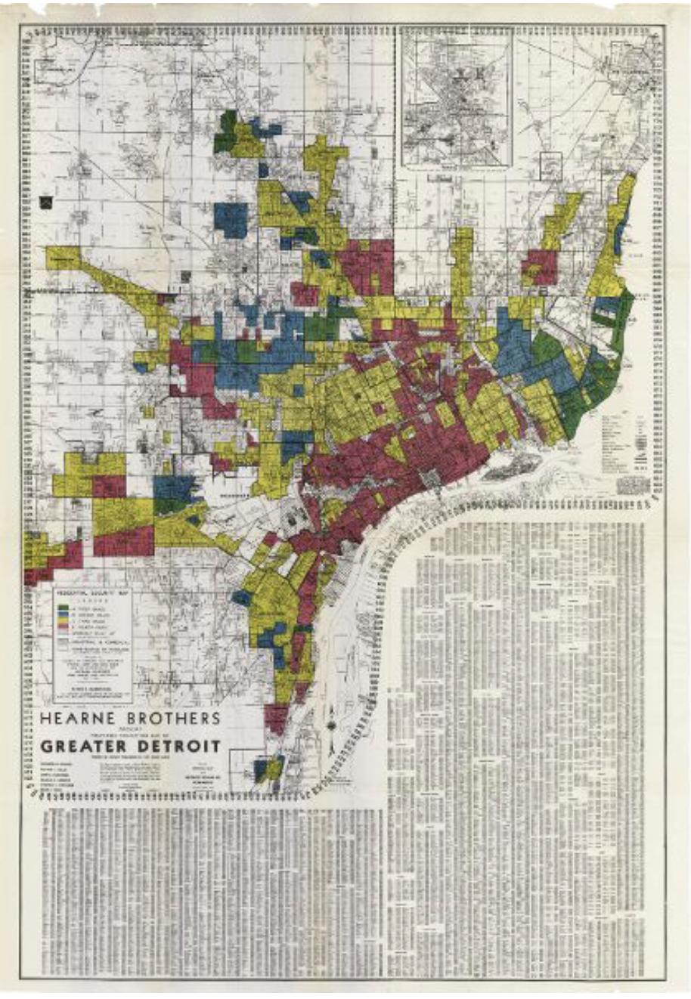

# Report about a Data Visualization in Data Feminism
## Laila Gmerek
*Date: 12 July 2023*
## Data Viz Summary

The image above is from the "Mapping Inequality: Redlining in New Deal America" project, revealing neighborhoods labeled as "high risk" for bank loans. These maps were designed to uphold the connection between wealth and whiteness, benefiting the white men on the Detroit Board of Commerce and their communities. As Data Feminism asks:

"Who makes maps and who gets mapped? The redlining map is one that secures the power of its makers: the white men on the Detroit Board of Commerce, their families, and their communities."

The redlining map served the interests of its creators, securing their power and perpetuating systemic oppression. In contrast, the DGEI map challenged this inequality. It compiled counterdata, focused on quantifying structural oppression, and was made by young Black people under the leadership of a Black woman, with support from academic geographers. The DGEI map emphasized the importance of diverse perspectives, proximity to the subject matter, and collaboration with marginalized communities. This stark contrast highlights the need for inclusive and equitable mapping practices that challenge power dynamics and address societal inequities.
## Data Viz Biography
**Who or what institution produced the visualization?**

The visualization was created as a collaboration between the Detroit Chamber of Commerce and the Federal Home Loan Bank Board.

**When was it produced?**

1939

**Who is the audience for the visualization?**

The visualization is generally relevant to anyone interested in studying or understanding the history of redlining. This could be anyone from a researcher to a student wanting to learn more about the history of racial injustice.

**How might the visualization be interpreted or misinterpreted? What consequences might this interpretation/misinterpretation have?**

The visualization serves as a significant historical document that sheds light on the deeply rooted racial injustices of the past. By examining this visualization, we gain valuable insights into the discriminatory practice of redlining that occurred in Detroit during the 1930s.

It is important, however, to ensure that the interpretation of this visualization remains accurate and nuanced. One potential misinterpretation could arise from viewing the map as a representation of the current state of neighborhoods in Detroit. This misinterpretation would overlook the historical context and fail to acknowledge the racial injustices that shaped these neighborhoods.

**How, if at all, does the data visualization represent power or systems?**

The image reflects the power structure between different races at the time. The visualization exposes the systemic natue of discrimination through redlining.

[More information about Redlining](https://www.npr.org/2017/05/03/526655831/a-forgotten-history-of-how-the-u-s-government-segregated-america)🎀